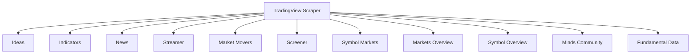

# TradingView Scraper

**A powerful, real-time Python library for extracting financial data, ideas, and indicators from TradingView.**

[Get Started](quick_start.md){ .md-button .md-button--primary } [View on GitHub](https://github.com/smitkunpara/tradingview-scraper){ .md-button .md-button--secondary }

---

## Why use this library?

The TradingView Scraper library exists to:

- Provide programmatic access to TradingView's extensive financial data
- Enable automated trading strategies and market analysis
- Support research and backtesting of trading algorithms
- Offer comprehensive market insights across multiple asset classes
- Deliver real-time data for live trading applications

## Target Audience

This library is designed for:

- **Quantitative traders** who need market data for algorithmic trading
- **Financial analysts** conducting market research and analysis
- **Data scientists** building predictive models for financial markets
- **Developers** creating trading applications and platforms
- **Investors** seeking comprehensive market insights

## Key Features

### Data Scraping Capabilities

- **Ideas**: Extract trading ideas, strategies, and market insights
- **Indicators**: Retrieve technical indicators (RSI, MACD, Stochastic, etc.)
- **News**: Scrape financial news and market updates
- **Real-time data**: Stream live OHLCV and indicator data
- **Market movers**: Identify top gainers, losers, and active stocks
- **Screener**: Filter stocks based on custom criteria
- **Symbol markets**: Find all exchanges where a symbol is traded
- **Markets overview**: Get top stocks by various metrics
- **Symbol overview**: Comprehensive symbol data including fundamentals
- **Minds community**: Access community discussions and insights
- **Fundamental data**: Income statements, balance sheets, cash flow data

### Supported Markets

The library supports 18+ markets including:
- **Stocks**: America, Australia, Canada, Germany, India, UK, Global
- **Cryptocurrencies**: 260+ exchanges including Binance, Coinbase, Kraken
- **Forex**: Major currency pairs and brokers
- **Commodities**: CME, NYMEX, COMEX
- **Indices**: S&P 500, NASDAQ, Dow Jones
- **Futures and Bonds**

### Technical Capabilities

- **Export formats**: JSON and CSV
- **Real-time streaming**: WebSocket-based data streaming
- **Historical data**: Access to historical market data
- **Custom filtering**: Advanced filtering and sorting options
- **Multi-symbol support**: Compare and analyze multiple symbols
- **Error handling**: Robust captcha handling and rate limiting

## Architecture Overview

The library follows a modular design with specialized classes for each data type:

This documentation provides a comprehensive introduction to the TradingView Scraper library. Refer to the specific module documentation for detailed usage instructions and advanced features.